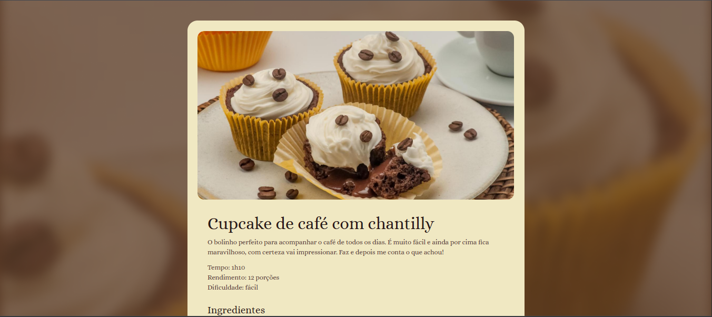

# 🍲 Página de Receita - Rocketseat Challenge

Este projeto foi desenvolvido como parte de um desafio do curso Fullstack da Rocketseat.  
O objetivo foi criar uma página estática apresentando uma receita culinária, aplicando os conhecimentos de estrutura HTML e estilização CSS.

## 📚 Descrição do projeto

A página inclui:

- Nome da receita
- Lista de ingredientes
- Passo a passo do preparo
- Imagem ilustrativa
- Layout simples e visualmente agradável

## 💻 Tecnologias utilizadas

- HTML5  
- CSS3  
- Semântica e organização de conteúdo  

## 🌐 Acesse o projeto online

🔗 [Clique aqui para ver o site publicado](https://kauasilvandrade.github.io/RevenuePage)

## 📸 Imagem do projeto

